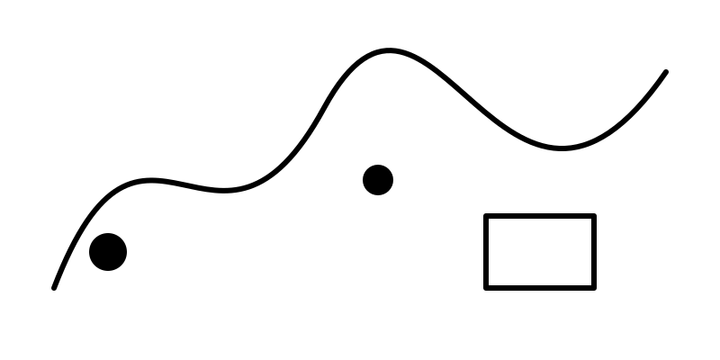

# Recolor Demo

Esta nota demonstra o efeito de recolorização.

## SVG (inline)

<!-- Exemplo simples de SVG (black strokes on white) -->
<svg class="demo-svg" width="240" height="120" xmlns="http://www.w3.org/2000/svg" viewBox="0 0 240 120">
  <rect width="240" height="120" fill="#ffffff"/>
  <g stroke="#000000" stroke-width="4" fill="none">
    <path d="M10 110 Q 60 10 110 110 T 210 110" />
  </g>
</svg>

## Raster-like image (data URI PNG)

<!-- A data URI abaixo é um PNG de 1x1 para exemplo; substitua por imagens reais para testar -->

> Note: abra esta nota com o snippet "Notebook Backgrounds.css" e o snippet "Recolor Variants.css" ativados para ver as variações.
